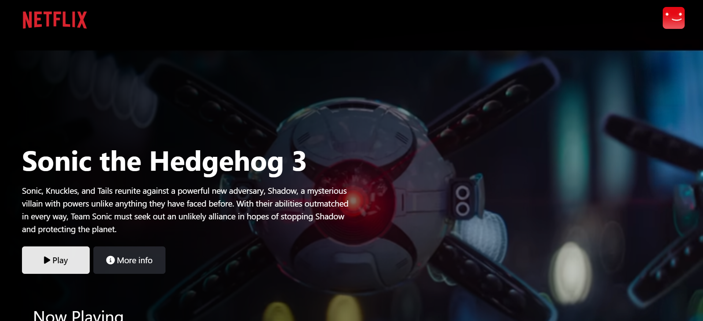
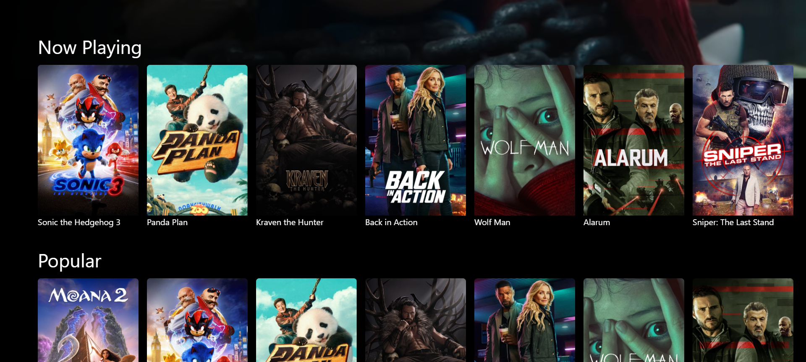
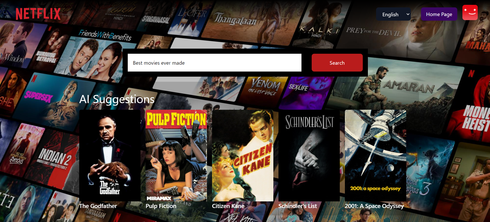

# NetflixGPT React Application

Welcome to the NetflixGPT React Application! This project is a Netflix-inspired web application that leverages Google's Gemini API to provide users with intelligent movie recommendations and an enhanced streaming experience.

## Table of Contents

- [Screenshots](#screenshots)
- [Features](#features)
- [Technologies Used](#technologies-used)
- [Getting Started](#getting-started)
- [Environment Variables](#environment-variables)
- [Project Structure](#project-structure)
- [Contributing](#contributing)
- [License](#license)
- [Important Information](#important-information)

## Screenshots

Login Page:


Home Page:


Home Page (Movie Lists):


AI Movie Suggestions:


## Features

- **User Authentication**: Secure login and registration system.
- **Movie Browsing**: Explore a vast collection of movies with detailed information.
- **Intelligent Recommendations**: Receive personalized movie suggestions powered by the Gemini API.

## Technologies Used

- **React**: JavaScript library for building user interfaces.
- **Tailwind CSS**: Utility-first CSS framework for styling.
- **Firebase**: Platform for authentication and hosting.
- **Google Gemini API**: Provides AI-driven movie recommendations.

## Getting Started

To get a local copy of the project up and running, follow these steps:

1. **Clone the Repository**:

   ```bash
   git clone https://github.com/KhalkarYash/netflix-gpt-react.git
   cd netflix-gpt-react
   ```

2. **Install Dependencies**:
   Ensure you have [Node.js](https://nodejs.org/) and npm installed. Then, run:

   ```bash
   npm install
   ```

3. **Set Up Environment Variables**:
   Create a `.env` file in the root directory and add the necessary API keys (see [Environment Variables](#environment-variables) section).

4. **Start the Application**:
   ```bash
   npm start
   ```
   The app will run in development mode. Open [http://localhost:3000](http://localhost:3000) to view it in your browser.

## Environment Variables

The application requires the following environment variables:

- `REACT_APP_TMDB_API_KEY`: Your API key from [The Movie Database (TMDB)](https://www.themoviedb.org/).
- `REACT_APP_GEMINI_API_KEY`: Your API key from [Google's Gemini API](https://ai.google.dev/).

Create a `.env` file in the root directory and add:

```
REACT_APP_TMDB_API_KEY=your_tmdb_api_key
REACT_APP_GEMINI_API_KEY=your_gemini_api_key
```

Replace `your_tmdb_api_key` and `your_gemini_api_key` with your actual API keys.

## Project Structure

```
netflix-gpt-react/
├── public/
│   ├── index.html
│   └── ...
├── src/
│   ├── components/
│   ├── pages/
│   ├── App.js
│   ├── index.js
│   └── ...
├── .env.example
├── .gitignore
├── firebase.json
├── package.json
├── README.md
└── ...
```

- **`public/`**: Contains static assets.
- **`src/`**: Contains the React components and pages.
- **`.env.example`**: Example environment variables file.
- **`firebase.json`**: Firebase configuration for hosting.
- **`package.json`**: Project metadata and dependencies.

## Contributing

Contributions are welcome! If you'd like to contribute, please fork the repository and use a feature branch. Pull requests are warmly welcome.

1. Fork the Project
2. Create your Feature Branch (`git checkout -b feature/AmazingFeature`)
3. Commit your Changes (`git commit -m 'Add some AmazingFeature'`)
4. Push to the Branch (`git push origin feature/AmazingFeature`)
5. Open a Pull Request

## License

This project is licensed under the MIT License. See the [LICENSE](LICENSE) file for details.

## Important Information

Use VPN to access. TMDB API is not accessible on all the networks.
